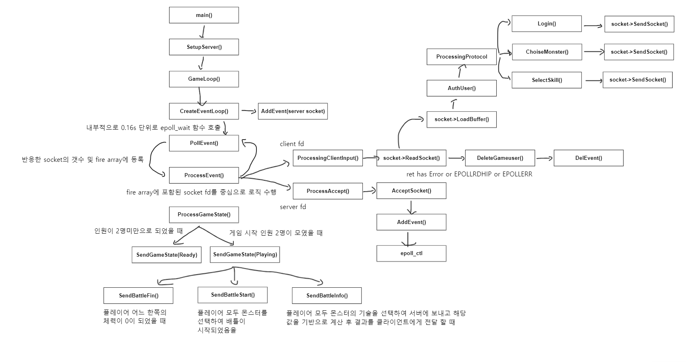
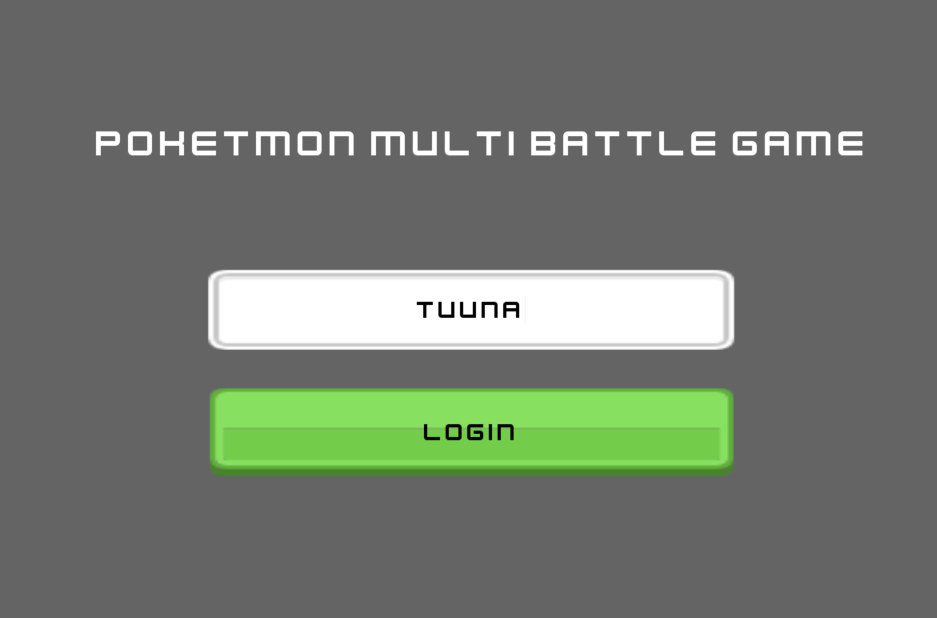
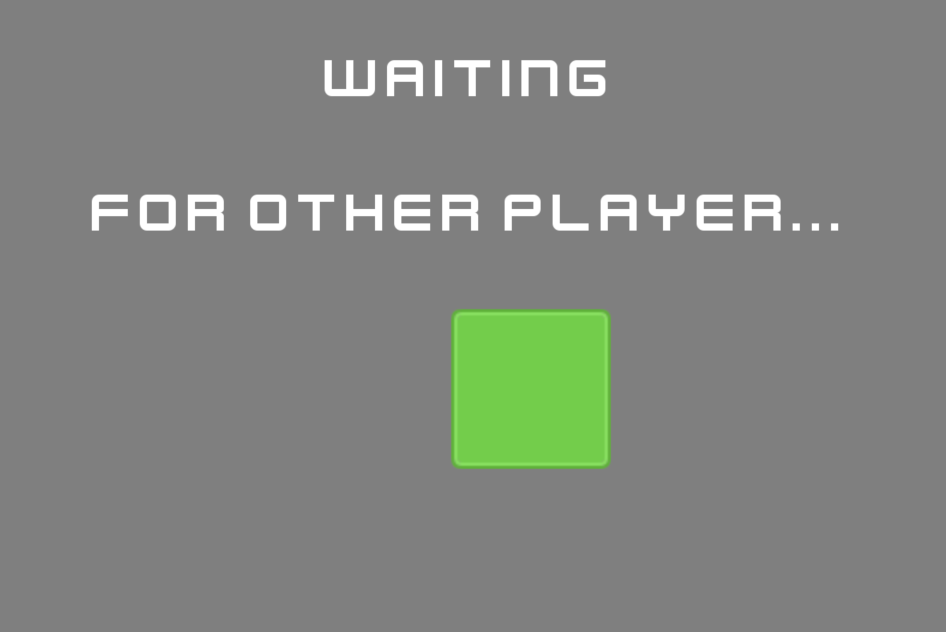
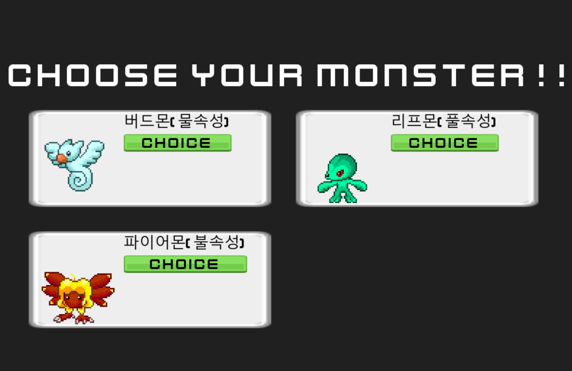
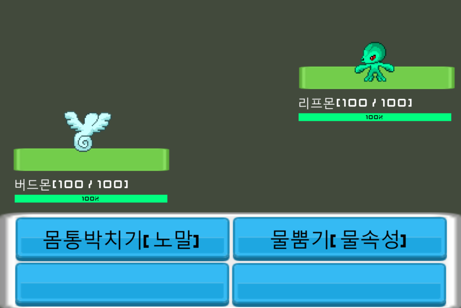
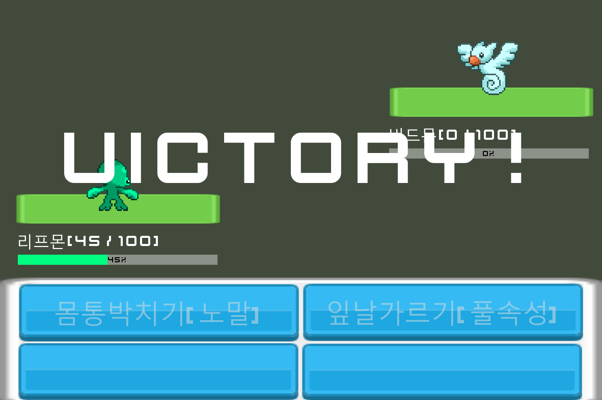

# multi_poketmon_battle
포켓몬 형식의 1대1 멀티 배틀게임입니다. 

# Tech Stack 
- Client  
Godot 4.0 

- Server  
C++ 

# Architecture 
서버의 경우 C++을 중심으로 epoll api를 사용하여 설계했습니다. 

# Image 

### Login  

### Waiting Other Player 

### Choice Monster 

### Play!

### Fin!
